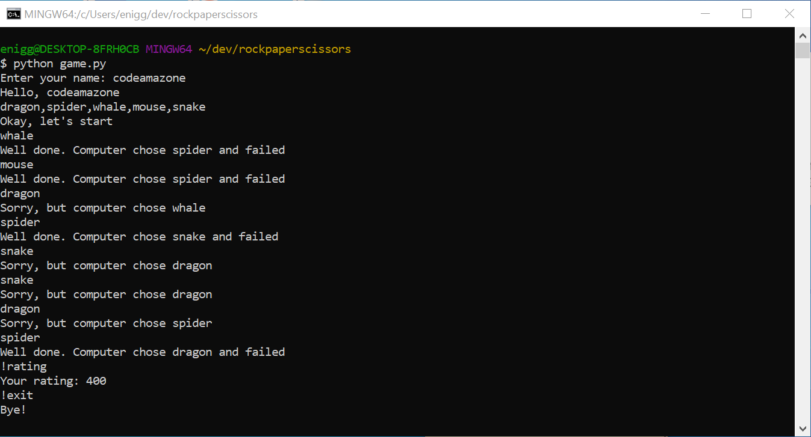

# Customizable game of rock-paper-scissors


A simple Python game of rock-paper-scissors with customizable options



# How to Play

- fork/clone the repository, open the directory in your console and start the game:

```
python game.py
```

- After entering your name, you'll be asked for your custom choices. Enter them, separated by commas with a space, or press "Enter" to continue with the default options.

## Possible commands:

Pick one of the defined options

```
rock
```

### Get your current score

```
rating
```

### Exit the game

```
exit
```

You gain 50 points if there is a draw and 100 points if you win.
The game runs infinetly as long as you don't exit it.
